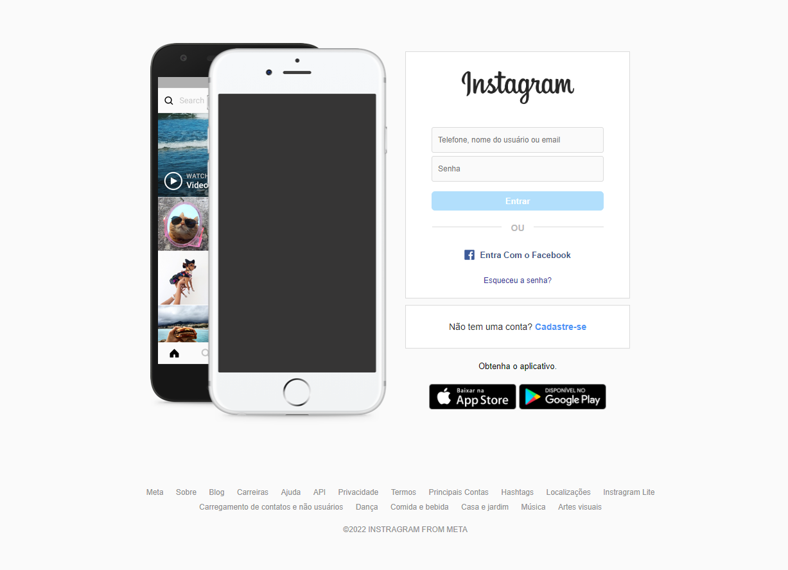

# CLONE INSTAGRAM

<p align="center">Recriando a interface de login do Instagram com CSS e HTML.</p>

<br>
<hr>

<div align="center">
<h2>Home Page</h2>

</div>

<br>
<hr>

### Pré-requisitos

<p>Antes de começar, você vai precisar ter instalado em sua máquina a seguinte ferramenta: <a href="https://git-scm.com/downloads">Git</a>. <br> Além disto é bom ter um editor para trabalhar com o código como o <a href="https://code.visualstudio.com/">Visual Studio Code</a>.</p>

### Rodando o Projeto
```bash
# Clone o repositório
$ git clone https://github.com/MaritoAmbrosio/clone_instagram.git

# Acessa a pasta do projeto no terminal/cmd
$ cd clone_instagram

# Abra o VSC
$ code .

# Instale a extensão Live Server na aréa de extensões

# Após instalada, clique com o botão direito no arquivo "index.html" e escolha a opção "Open with Live Server"
```
<hr>

### Tecnologias
<p>As seguintes ferramentas foram usadas na construção desse projeto.</p>

<ul>
  <li> Html</a> </li>
  <li> Css </li>
  <li> <a href="https://code.visualstudio.com/">Visual Studio Code </a> </li>
</ul>

<hr>
<p>Feito por Mario Ambrosio 🖥️<a href="https://www.linkedin.com/in/mario-ambrosio-406353203">Linkedin</a> </p>


